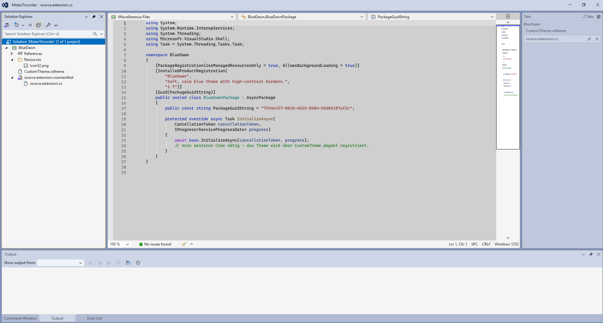
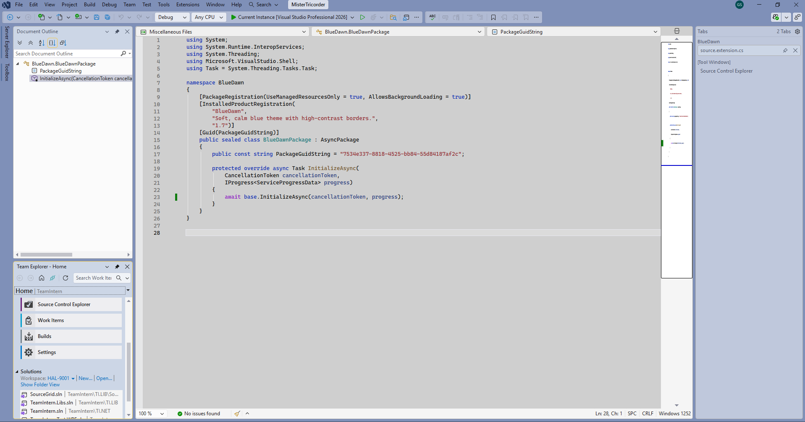

# Blue Dawn

A calm, high-contrast blue theme for Visual Studio 2022 and later.

Blue Dawn is designed to reduce eye strain while keeping focus and structure
clearly visible. It uses soft blue surfaces combined with darker framing and
high-contrast accents.

---

## Screenshots

### Editor & Focused Content

### Tool Windows & Layout

---

## Features

- Soft blue background with darker framing for reduced eye strain
- High-contrast borders and accents for better focus
- Clear visual separation between active and inactive areas
- Designed for long coding sessions
- Suitable for partial color blindness

---

## Installation

1. Download the `BlueDawn.vsix` file.
2. Open it with Visual Studio 2022 or 2026 (double-click).
3. Go to  
   **Tools → Options → Environment → General**
4. Select **“Blue Dawn”** as the color theme.

---

## Compatibility

- Visual Studio 2022 (17.x)
- Visual Studio 2026 and later  
  (as long as VSIX v3 themes are supported)

---

## License

This project is licensed under the MIT License.  
See `Resources/LICENSE.txt` for details.

---

## Credits

Originally inspired by the *Blue Steel* theme by Mads Kristensen.

Adapted, refined, and maintained by **Mister Tricorder**.

> “Make it so.”
